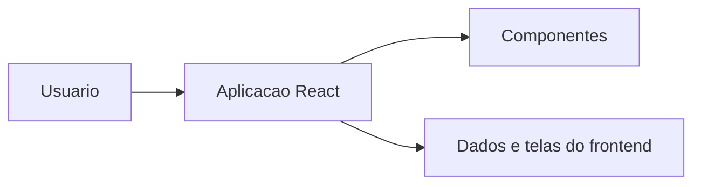

# Site RH 1.0

Prototipo frontend para portal de recursos humanos, recrutamento e selecao, desenvolvido com React, TypeScript e Vite.

## Visao Geral

O projeto apresenta uma interface web voltada a processos de RH. Pelo conteudo do repositorio, a aplicacao concentra telas e componentes para apresentar vagas, candidatos, fluxos de recrutamento ou informacoes institucionais relacionadas a recursos humanos.

## Problema Resolvido

A proposta e organizar digitalmente uma experiencia de RH, facilitando a apresentacao de oportunidades, acompanhamento de etapas e comunicacao visual de processos de recrutamento.

## Principais Funcionalidades

### Funcionalidades Disponiveis

- Interface frontend em React.
- Componentes com TypeScript.
- Estrutura Vite.
- Organizacao visual para portal de RH.
- Conteudo e telas relacionadas a recrutamento.

### Funcionalidades Em Desenvolvimento

- Ajustes de interface e dados aparecem no codigo da aplicacao.

### Funcionalidades Planejadas

- Informacao nao confirmada no conteudo atual do repositorio.

## Como Funciona

```text
Usuario acessa o portal
-> navega pela interface de RH
-> consulta informacoes ou fluxos apresentados
-> componentes frontend organizam a experiencia
-> o resultado e exibido na propria aplicacao web
```

## Tecnologias Utilizadas

- TypeScript
- React
- Vite
- Tailwind CSS
- Node.js

## Arquitetura



## Estrutura Do Projeto

- `src/`: codigo da aplicacao frontend.
- `public/`: arquivos publicos.
- `deploy/`: instrucoes e arquivos auxiliares de publicacao.
- Arquivos de configuracao do Vite, TypeScript e Tailwind.

## Status

Prototipo frontend / projeto em desenvolvimento. Nao ha confirmacao de uso em producao no conteudo atual do repositorio.

## Autor

Desenvolvido por Michele Santana — Kalion Tecnologia

Perfil profissional: https://github.com/Tr3mbolon4
